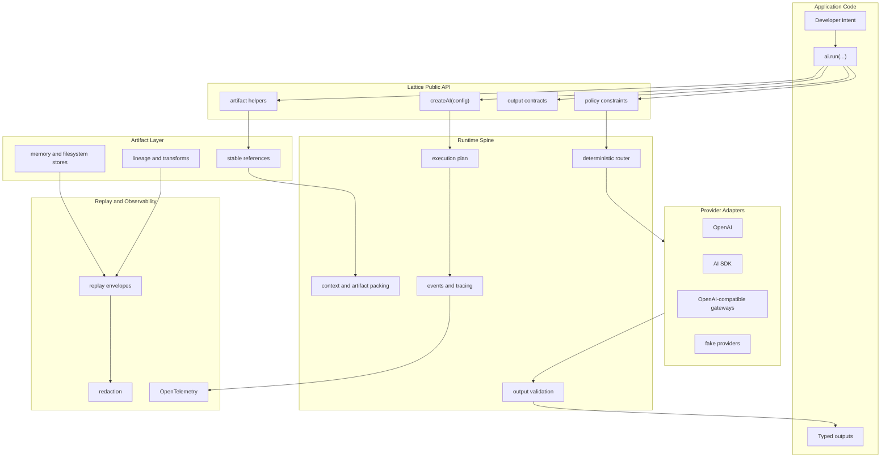

<div align="center">

# Lattice

**Capability-first runtime SDK for multimodal AI applications**

Describe the job. Attach any mix of artifacts. Declare the outputs you want. Set policy constraints. Lattice is built to handle the route, packaging, validation, and inspectable plan.


[Overview](#overview) | [Quick Start](#quick-start) | [API](#api) | [Architecture](#architecture) | [Roadmap](#roadmap) | [Contributing](#contributing)

</div>

---

## Overview

Lattice is a TypeScript-first capability runtime SDK for AI applications. It is built for developers who want to process mixed text, images, audio, video, files, JSON, and tool results without wiring together separate chat, transcription, speech, file, memory, provider, routing, and replay abstractions by hand.

The public API is intentionally small:

```ts
await ai.run({
  task: "Resolve this support case",
  artifacts: [artifact.text("Customer was charged twice.")],
  outputs: {
    answer: "text",
    action: z.object({
      kind: z.enum(["refund", "replace", "escalate", "clarify"]),
      reason: z.string(),
    }),
  },
  policy: {
    maxCostUsd: 2,
    privacy: "sensitive",
  },
});
```

Lattice's long-term goal is to make this one call inspectable and reliable: deterministic routing, context packing, artifact transport, provider fallback, output validation, replay, cost/latency accounting, and traceable execution plans.

> **Current status:** Phase 1 is implemented. The package exposes the API spine, artifact helpers, output contracts, typed validation, provider adapter execution, policy merging, session references, and plan stubs. Durable artifact storage, deterministic routing, real provider packaging, context packing, replay, MCP tools, and the work-inbox showcase are on the roadmap.

---

## The Problem

Modern AI features are rarely just "send a prompt to a model." A real product flow might need:

- A user message
- A screenshot or product photo
- A PDF policy document
- A call recording or transcript
- Structured JSON output
- Citations back to source artifacts
- Budget, privacy, latency, and provider constraints
- A plan that explains what happened when something fails

Without a runtime layer, every app ends up rebuilding the same machinery: file normalization, model selection, prompt packing, provider-specific message shapes, schema validation, retries, fallbacks, logging, and replay.

## The Lattice Approach

Lattice treats the job as a capability request instead of a provider call.

| You provide | Lattice owns |
|---|---|
| Task intent | Runtime plan and execution boundary |
| Artifacts | Artifact references, metadata, lineage, and transport choices |
| Desired outputs | Text, Standard Schema/Zod JSON, citations, generated artifact refs |
| Policy | Budget, latency, privacy, provider allow/deny, upload/logging constraints |
| Optional providers | Narrow provider adapters that do not leak SDK types into your app |
| Session reference | Future context, replay, branch, and history behavior |

The result is a typed `RunResult` with either validated outputs or a structured failure, plus an execution plan object that grows into the audit trail for routing, packaging, fallback, usage, and latency decisions.

---

## What Works Today

Phase 1 gives the project a compiled, tested TypeScript package foundation.

| Area | Status |
|---|---|
| `createAI(config)` runtime facade | Implemented |
| `ai.run({ task, artifacts, outputs, policy })` | Implemented with executable provider adapters |
| `ai.session(id)` | Implemented as a reference placeholder |
| `artifact.text`, `artifact.json`, `artifact.file`, `artifact.url` | Implemented as lightweight refs |
| Text output contract | Implemented with validation |
| Standard Schema / Zod structured outputs | Implemented with typed inference and validation |
| Citation and generated artifact-ref outputs | Implemented with validation |
| Policy defaults and per-run overrides | Implemented |
| Execution plan | Implemented as a Phase 1 stub |
| Real provider adapters, routing, storage, context packing, replay | Planned |

---

## Quick Start

### Requirements

- Node.js 24 or newer
- pnpm 10 or newer
- TypeScript 6

### Use From This Repository

```bash
git clone https://github.com/LakshmanTurlapati/Lattice.git
cd Lattice
pnpm install
pnpm build
pnpm test
```

### Package Install

The package name is `lattice`. Publishing is not the focus of Phase 1 yet, but the intended install path is:

```bash
pnpm add lattice zod
```

### First Run With a Fixture Provider

The current runtime executes any configured provider adapter with an `execute()` function. This makes the public API testable before real provider packaging lands.

```ts
import { z } from "zod";
import {
  artifact,
  createAI,
  output,
  type ProviderAdapter,
} from "lattice";

const fixtureProvider = {
  id: "fixture",
  kind: "provider-adapter",
  execute: async (request) => {
    console.log(request.task);
    console.log(request.outputs);

    return {
      rawOutputs: {
        answer: "Refund approved.",
        action: {
          kind: "refund",
          reason: "duplicate charge",
        },
        evidence: [
          {
            artifactId: "artifact:text:case-note",
            label: "case note",
          },
        ],
        generated: [],
      },
    };
  },
} satisfies ProviderAdapter;

const ai = createAI({
  providers: [fixtureProvider],
  defaults: {
    policy: {
      maxCostUsd: 5,
      latency: "interactive",
    },
  },
});

const result = await ai.run({
  task: "Resolve this support case",
  artifacts: [
    artifact.text("Customer was charged twice.", {
      id: "artifact:text:case-note",
      label: "case note",
    }),
  ],
  outputs: {
    answer: "text",
    action: z.object({
      kind: z.literal("refund"),
      reason: z.string(),
    }),
    evidence: output.citations(),
    generated: output.artifacts({ artifactKind: "file" }),
  },
  policy: {
    maxCostUsd: 2,
    privacy: "sensitive",
    noLogging: true,
  },
});

if (result.ok) {
  result.outputs.answer;
  result.outputs.action.reason;
  result.plan;
} else {
  console.error(result.error);
  console.error(result.plan);
}
```

---

## API

### `createAI(config)`

Creates a Lattice runtime.

```ts
const ai = createAI({
  providers: ["openai", fixtureProvider],
  defaults: {
    policy: {
      maxCostUsd: 10,
      latency: "interactive",
      noUpload: true,
    },
  },
  storage: false,
  tracing: false,
});
```

Configuration accepts Lattice-owned provider, storage, tracing, and policy contracts. Provider SDK types stay outside the public API boundary.

### `artifact`

Phase 1 artifact helpers create provider-neutral artifact inputs:

```ts
artifact.text("support case");
artifact.json({ orderId: "ord_123" });
artifact.file(new Blob(["receipt"]));
artifact.url("https://example.com/policy.pdf");
```

Artifacts currently carry IDs, kinds, sources, media types, labels, values, and metadata. Storage references, privacy labels, lineage, MIME sniffing, hashing, and transforms are planned in Phase 2.

### `outputs`

Lattice supports multiple named outputs from one run:

```ts
outputs: {
  answer: "text",
  action: z.object({
    kind: z.literal("refund"),
    reason: z.string(),
  }),
  evidence: output.citations(),
  generated: output.artifacts(),
}
```

Structured outputs use the Standard Schema boundary, so Zod and other compatible validators can be normalized without making Lattice a Zod-only runtime.

### `policy`

Policies are explicit and merge runtime defaults with per-run overrides:

```ts
policy: {
  maxCostUsd: 2,
  latency: "batch",
  privacy: "restricted",
  providerAllowList: ["openai"],
  providerDenyList: ["experimental-provider"],
  noUpload: true,
  noPublicUrl: true,
  noLogging: true,
}
```

In Phase 1, policy is passed to executable adapters. Later phases use it for deterministic route filters, packaging decisions, fallbacks, and replay redaction.

---

## Architecture



### Package Shape

```text
Lattice/
|-- packages/
|   `-- lattice/
|       |-- src/
|       |   |-- artifacts/      # artifact references and helpers
|       |   |-- outputs/        # output contracts, inference, validation
|       |   |-- plan/           # execution plan stubs
|       |   |-- policy/         # policy contracts and merging
|       |   |-- providers/      # narrow provider adapter contracts
|       |   |-- results/        # typed run success/failure results
|       |   |-- runtime/        # createAI facade and config normalization
|       |   |-- sessions/       # session refs
|       |   |-- storage/        # storage interface
|       |   `-- tracing/        # tracing interface
|       |-- test/               # Vitest runtime tests
|       `-- test-d/             # tsd package boundary tests
|-- .planning/                  # GSD project plans and state
|-- package.json
|-- pnpm-workspace.yaml
`-- tsconfig.base.json
```

---

## Roadmap

| Phase | Goal | Status |
|---|---|---|
| 1. Runtime API and Output Contracts | Small TypeScript API, typed outputs, validation, provider-neutral contracts | Complete |
| 2. Artifact Lifecycle and Storage | Stable artifact IDs, metadata, privacy labels, memory/filesystem stores, lineage | Planned |
| 3. Deterministic Planning and Execution Spine | Dry-run plans, capability catalog, deterministic routing, fake providers, lifecycle events | Planned |
| 4. Context, Sessions and Provider Packaging | Durable sessions, context packs, OpenAI/AI SDK/OpenAI-compatible adapters, policy-safe packaging | Planned |
| 5. Tools, Replay and Observability | Local/MCP tools, replay envelopes, redaction, OpenTelemetry-compatible traces | Planned |
| 6. Work Inbox Showcase | Executable multimodal support/work-inbox example through the public API | Planned |

The wedge use case is a multimodal work inbox: a user message, screenshot/photo, audio or transcript, and PDF/manual/policy document become a human-readable answer, structured action, citations, generated artifacts, and an inspectable execution plan.

---

## Development

```bash
# Install workspace dependencies
pnpm install

# Build all packages
pnpm build

# Typecheck all packages
pnpm typecheck

# Run unit tests
pnpm test

# Run declaration/type API tests
pnpm test:types

# Verify package publishing shape
pnpm lint:packages
```

### Current Quality Gates

- TypeScript strict mode
- `exactOptionalPropertyTypes`
- `noUncheckedIndexedAccess`
- Vitest runtime tests
- Vitest typecheck tests
- `tsd` declaration tests
- `publint`
- `@arethetypeswrong/cli`

---

## Design Principles

- **Capability first:** Users describe the job and outputs, not the provider-specific API call.
- **Small public surface:** The beginner path stays one `run` call with artifacts, outputs, and policy.
- **Provider-neutral core:** Provider SDK types stay behind adapters.
- **Deterministic routing:** Early routing should be explainable and reproducible, not opaque model magic.
- **Artifacts everywhere:** Inputs, outputs, tool results, transcripts, generated files, and provider handles all become traceable artifacts.
- **Inspectable execution:** Every run should explain model choices, context packing, artifact transforms, cost, latency, fallbacks, and validation.

---

## Contributing

1. Fork the repository.
2. Create a feature branch.
3. Run `pnpm install`.
4. Make focused changes that preserve the small public API.
5. Run `pnpm typecheck`, `pnpm test`, and `pnpm test:types`.
6. Open a pull request with the behavior change, test coverage, and any public API implications.

Architecture notes for contributors: keep `packages/lattice/src/index.ts` intentionally small, keep provider SDK details out of public exports, and treat `.planning/` as the source of roadmap and phase context.

---

## License

[MIT](LICENSE)

---

<div align="center">

Built by [Lakshman Turlapati](https://github.com/LakshmanTurlapati)

If Lattice helps you build cleaner multimodal AI features, consider giving it a star.

[Back to top](#lattice)

</div>
